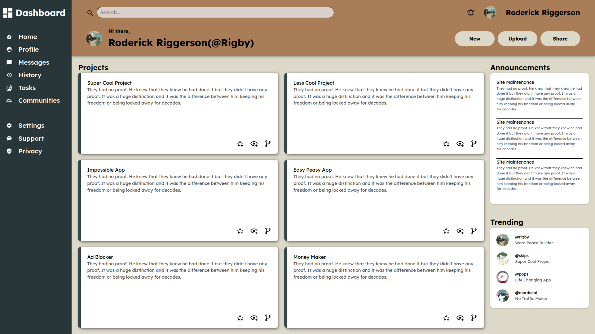

<h1>Admin Dashboard</h1>

A modern, responsive admin dashboard built using HTML, CSS, and Google Fonts—designed with a clean layout, sidebar navigation, interactive project cards, and a structured grid system.

This project is great for learning layouts, CSS grid, flexbox, and building an admin interface from scratch.

<h2>🚀 Features</h2>
<h3>📌 Sidebar Navigation</h3>

<ul>
    <li>Dashboard</li>
    <li>Home</li>
    <li>Profile</li>
    <li>Messages</li>
    <li>History</li>
    <li>Tasks</li>
    <li>Communities</li>
    <li>Settings</li>
    <li>Support</li>
    <li>Privacy</li>
    <li>Each with SVG icons for a clean UI.</li>
</ul>

<h3>📌 Header Section</h3>

<ul>
    <li>Includes:</li>
    <li>Search bar</li>
    <li>Notification icon</li>
    <li>User profile</li>
    <li>Greetings block with action buttons (New, Upload, Share)</li>
</ul>

<h3>📌 Main Content</h3>

<ul>
    <li>“Projects” section with multiple cards</li>
    <li>Each project card includes:</li>
    <li>Title</li>
    <li>Description</li>
    <li>Action icons (favorite, view, branch)</li>
</ul>

<h2>🖼️ Screenshots</h2>

